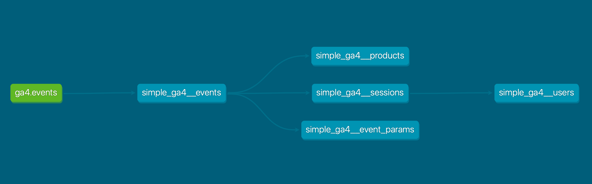

# simple_ga4_dbt

`simple_ga4_dbt` is an open-source dbt package that provides a streamlined, cost-efficient way to transform raw GA4 data in BigQuery into easily accessible marts.
With this package, you get a set of opinionated models and configurations that are optimized for the needs of most marketers, allowing you to leverage raw GA4 data without extensive custom setup.

## Models



| Model                            | Description                                                                              | Materialization   |
|----------------------------------|------------------------------------------------------------------------------------------|-------------------|
| **simple_ga4__events**           | Sessionized clean events with many parameters flattened out.                             | Incremental Table |
| **simple_ga4__products**         | Sessionized clean e-commerce item events with many parameters flattened out.             | Incremental Table |
| **simple_ga4__event_parameters** | Detailed breakdown of all event parameters by key for deep dives into custom parameters. | View              |
| **simple_ga4__sessions**         | Sessions with various metrics, including last and last non-direct attribution.           | Incremental Table |
| **simple_ga4__users**            | User data with metrics including first touch attribution.                                | View              |


## Molly Integration

While `simple_ga4_dbt` is a powerful standalone package that has substantial standalone value to data engineers, it also serves as the open-source core for the GA4 portions of the [Molly](https://www.admindanalytics.com/molly/?utm_source=github%20simple-ga4-dbt&utm_medium=referral&utm_content=README) GA4 add-on suite.

### Molly Add-Ons

- [Molly Segments](https://www.admindanalytics.com/segmentation/?utm_source=github%20simple-ga4-dbt&utm_medium=referral&utm_content=README): the no-code data-cleaner/segment-maker for GA4 data in BigQuery. The benefits of web analytics in a warehouse without the need to manage infrastructure or write SQL.
- [Molly Quality Monitor](https://www.admindanalytics.com/data-quality-monitoring/?utm_source=github%20simple-ga4-dbt&utm_medium=referral&utm_content=README): Continuous data quality scores that guarantee you can trust the GA4 data you're looking at. Bye bye ObservePoint and DataTrue.
- [Molly Cause & Effect](https://www.mollydata.io/?utm_source=github%20simple-ga4-dbt&utm_medium=referral&utm_content=README): ongoing performance change detection to make sure performance changes never fly under your radar again.
- [Molly Reports](https://www.admindanalytics.com/molly-reports/?utm_source=github%20simple-ga4-dbt&utm_medium=referral&utm_content=README): Looker Studio templates that 
  - recover all lost Universal Analytics functionality (ecommerce shopping behavior, product list performance, user explorer, and many more)
  - expose Molly Segments for instant analysis
  - warn about data quality scores from Molly Quality Monitor that would compromise analysis 
  - expose key performance changes and the causal annotations from Molly Cause & Effect
  - integrate cost data and CRM data
  - connect aggregate analysis with user recordings

### Join the Molly Beta
Molly is currently in a closed beta - if you've been thinking about these problems and think your experience could help shape Molly's value, [contact us](www.admindanalytics.com/contact/?utm_source=github%20simple-ga4-dbt&utm_medium=referral&utm_content=README)

## Opinionated Defaults

This package encodes many best practices for most GA4 implementations:

- **Sessionization**: Sessions are determined based on event times and require a `session_start` event. This is configurable.
- **Attribution**: First-touch, last-touch, and last-non-direct attribution models are baked in to give you quick insights into conversion paths.
- **Incremental Loading**: Models are set to materialize incrementally by default, optimizing both cost and performance.
- **No Aggregation**: Data is not aggregated ahead of visualization. We've found this adds complexity without substantial gains, especially in BigQuery.
- **No External Dependencies**: This package does not rely on any external dbt packages, ensuring minimal setup complexity.

## Comparison with GA4 UI

This package is designed to replicate and enhance the GA4 UI experience within your BigQuery environment, offering additional flexibility and customization.

- **Custom Attribution Windows**: Easily adjust lookback windows and attribution models.
- **Detailed Event Parameter Analysis**: Break down custom parameters at a granular level, which is difficult to do directly in GA4.
- **Flexible Session Definitions**: Modify sessionization logic to better suit your business needs.


## Installation and Running

- CLI
  - gcloud
  - python (3.10)
  - prefer to setup virtualenv
  - `pip install -r requirements.txt`
  - `dbt compile`
    - check that no errors (have dbt_project.yml set correctly)
  - `dbt build`
- DBT Cloud
  - account settings -> projects -> new project
  - add a new connection to BigQuery

## Installation

### Prerequisites

- **Google Cloud Project**: Ensure you have a Google Cloud Project with access to GA4 data in BigQuery.
- **dbt**: Install [dbt](https://docs.getdbt.com/docs/get-started/installation) (version 1.x or higher).
- **gcloud**: Install the [Google Cloud SDK](https://cloud.google.com/sdk/docs/install).
- **Python 3.10 or newer**: Recommended to manage environments using `virtualenv`.

### Step-by-Step Guide

1. **Clone the Repository**:
    ```sh
    git clone https://github.com/your-repo/simple_ga4_dbt.git
    cd simple_ga4_dbt
    ```

2. **Set Up Your Environment**:
    ```sh
    virtualenv venv
    source venv/bin/activate
    pip install -r requirements.txt
    ```

3. **Configure Your Profile**:
    Update `profiles.yml` with your Google Cloud Project and dataset.
    
4. **Add your GA4 Properties** to the `ga4_properties` list in `dbt_project.yml`.

    ```yml
    vars:
      ga4_properties:
        - name: marketing-website.com
          source_gcp_project: marketing-project
          dataset: analytics_222222222
      ```
   
5. **Verify your setup**:
    - `dbt debug`

6. **Run dbt**:
    - **Build**:
      ```sh
      dbt build
      ```

### dbt Cloud (Optional)

- Set up a new project in DBT Cloud and connect it to your BigQuery account.

## License

This project is licensed under the MIT License - see the [LICENSE](LICENSE) file for details.
